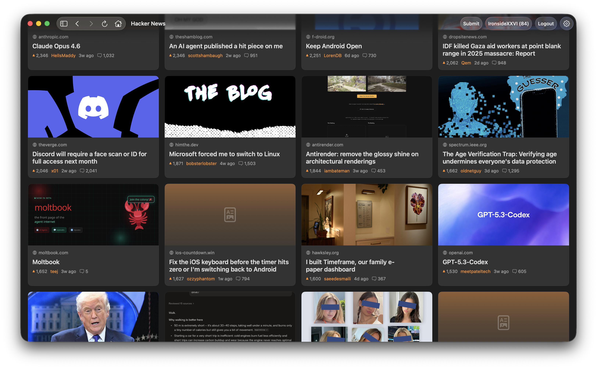
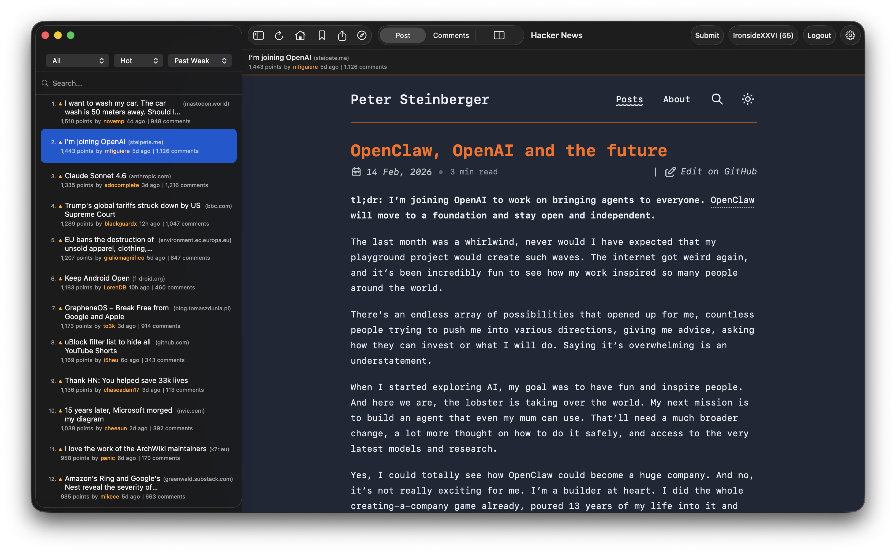
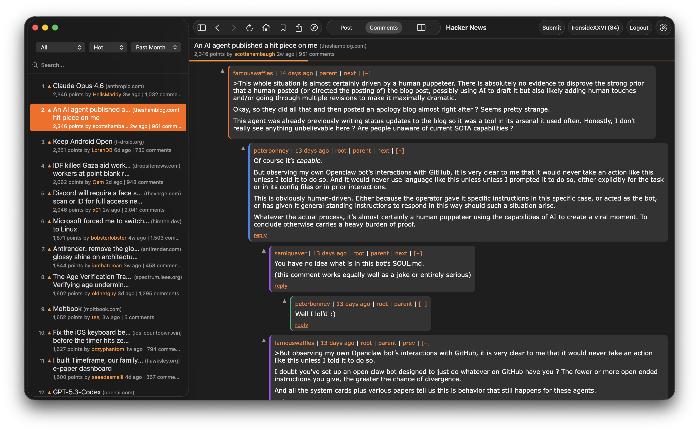
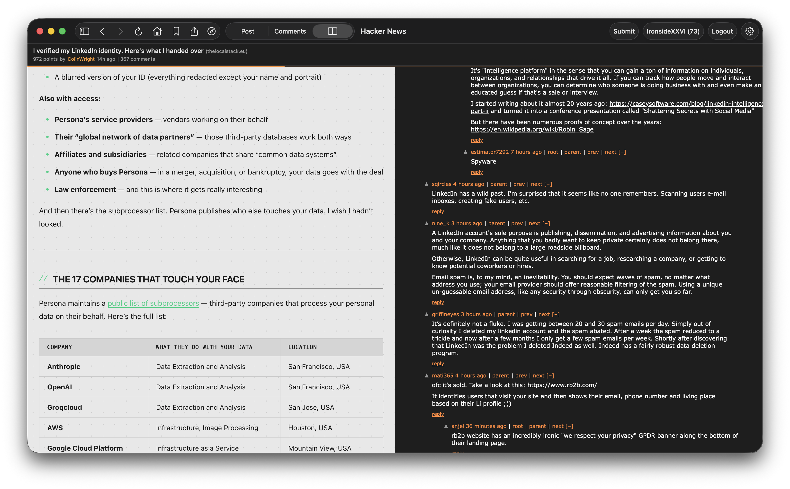

# Hacker News

A native macOS client for [Hacker News](https://news.ycombinator.com), built with SwiftUI.


## Screenshots






## Install

Download the latest DMG from the [Releases](https://github.com/IronsideXXVI/Hacker-News/releases) page, open it, and drag the app to Applications. That's it — no Xcode or developer tools needed.

Requires **macOS 14.0** or later.

## Building from Source

For developers who want to build and modify the code:

1. Clone the repository
   ```bash
   git clone https://github.com/IronsideXXVI/Hacker-News.git
   ```
2. Open `Hacker News.xcodeproj` in Xcode 26+
3. Build and run (Cmd+R)

Swift packages (Sparkle) will resolve automatically.

## License

[MIT](LICENSE)
